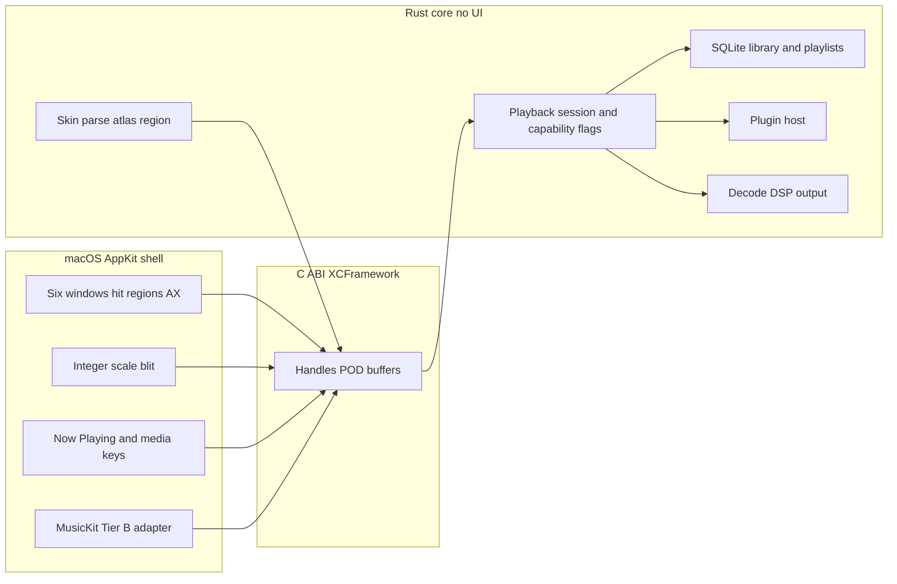

# LLaMP architecture

The core has no UI. Each platform shell owns windows, input, accessibility, and drawing. This split is not a suggestion. A future session that puts a BMP parser in Swift, or an `NSWindow` in Rust, is off the plan. See [ADR 001](adr/001-core-language.md), [ADR 002](adr/002-macos-ui.md), and [ADR 003](adr/003-ffi.md).

Related specs: [audio](spec/audio-pipeline.md), [skin](spec/skin-format.md), [plugins](spec/plugin-abi.md), [providers](spec/providers.md), [visualizer](spec/visualizer.md), [lyrics](spec/lyrics.md), [brand](spec/brand.md).

## System

Windows and Linux shells replace the AppKit box and call the same C ABI. MusicKit stays in the macOS shell because it is a Swift framework that does not yield PCM. It is a Tier B provider adapter, not a decoder.

## Module boundaries

| Module | Crate | Owns | Must not |
| --- | --- | --- | --- |
| Session | `llamp-core` | Play queue, transport policy, capability flags, which window of time the UI may display | Draw, open a window, call CoreAudio directly |
| Audio | `llamp-audio` | Decode, resample, DSP, rings, `Output` trait | Parse a skin, know about Spotify |
| Skin | `llamp-skin` | ZIP, BMP, atlas, regions, bitmap font, CPU reference blit | Draw to a window, allocate in an audio callback |
| Library | `llamp-library` | SQLite, import copy, tags, artwork cache, playlists on disk | Decode audio for playback |
| Plugin API | `llamp-plugin-api` | Kinds, manifest types, capability bits | Load a dylib or wasmtime |
| Plugin host | `llamp-plugin-host` | Native loader, wasmtime, kill switches | Run on the audio callback unless the plugin kind is first-party DSP and the host has already checked that |
| FFI | `llamp-ffi` | C ABI, cbindgen | Leak a Rust type, contain a window |
| CLI | `llamp-cli` | Headless harness | Be a supported end-user scripting product in 1.0 |
| macOS shell | `shells/macos` | AppKit, AX, integer blit, media keys, MusicKit adapter, Sparkle | Parse BMP, run EQ math |

`llamp-core` may call the other crates. The shell may call only `llamp-ffi`. Plugins may call only the host functions their kind and capabilities grant.

## Threading

Five threads. Names are the contract; the OS thread names in the binary should match.

| Thread | May allocate | May lock | May do I/O | Work |
| --- | --- | --- | --- | --- |
| Audio callback | No | No | No | Pop frames, DSP, write device buffer, try-push analysis, store atomics |
| Decode | Yes | Yes, not the audio callback | Yes, reads | Demux, decode, resample, push the audio ring |
| Analysis | Yes | Yes, not the audio callback | No | FFT, RMS, peak, onset, write the UI snapshot |
| Library | Yes | Yes | Yes, disk and network | Import, scan, tag write, provider HTTP, lyrics fetch |
| UI | Yes | Yes, not the audio callback | Yes | Draw, input, accessibility |

The audio callback and the UI share no mutex. They share:

- An `rtrb` SPSC ring of interleaved stereo `f32` at the device rate. Decode is the producer. The callback is the consumer. The ring is allocated before the stream starts. If the callback would underrun, it writes silence, increments an atomic underrun counter, and returns. It does not allocate a larger buffer.
- A second `rtrb` ring, analysis-bound. The callback `try_push`es a small PCM chunk. If the ring is full, the chunk is dropped. Analysis falling behind never blocks audio.
- A seqlock (or a triple buffer of the same shape) holding a POD `UiSnapshot`: RMS, peak, spectrum bins for the 76×16 pane, position in frames, duration in frames, transport state, capability flags. Analysis and the session thread write it. The UI reads the latest consistent copy and retries if the sequence number tears. One retry, then it keeps the previous snapshot.
- `AtomicU64` playback frame counter, written by the callback, read by anyone. This is the playback clock. Lyrics and the seek bar use it for Tier A. They do not use wall time.

UI state that is not a snapshot (the playlist selection, a slider drag) moves UI → session on the library or a dedicated control channel (`rtrb` of commands, or a bounded crossbeam channel that the audio callback never waits on). The session applies the command on the decode or library thread and publishes the result in the next snapshot. A volume drag updates a target gain atomically; the callback slews to it. The callback does not take the drag’s lock.

## Data flow, Tier A

A Tier A source produces bytes we decode.

1. `MediaSource` opens a read (file, HTTP body, radio socket) on the library or decode thread.
2. `symphonia`, or a platform `Decoder` plugin, emits `f32` frames at the file’s rate and channel count.
3. Downmix or upmix to stereo. Channel layout beyond stereo is folded. This is a documented limitation, not an accident.
4. `rubato` resamples to the **output device rate**, once. There is no second resample in the callback.
5. Decode pushes stereo `f32` into the audio ring. Gapless and crossfade are applied here, into the preallocated ring, not in the callback.
6. The callback pops the device’s requested frame count and runs, in order, in place: ReplayGain gain, user preamp, 10-band biquad cascade, first-party DSP chain, limiter. TPDF dither only if the device format is integer. CoreAudio float is not dithered.
7. The callback try-pushes a copy of the post-DSP frames into the analysis ring.
8. Analysis writes the snapshot. The shell blits the 76×16 pane from that snapshot using `viscolor.txt`. The full visualizer window samples the same snapshot. It does not install its own tap on the callback.

If the source is live (Icecast), seek is off, duration is unknown, and gapless does not apply. EQ still applies, because we have PCM.

## Data flow, Tier B

A Tier B source does not give PCM. Spotify Connect and Apple Music are this tier. The session publishes capability flags. See [providers](spec/providers.md).

The decode graph is idle. The callback is not running for that session, or it is running silence because a device is held; prefer not holding the device. Transport commands go to the provider. Position is interpolated between polls and snapped on each poll. The playback clock for lyrics, if any, is the provider’s reported position, not `AudioTimeStamp` and not wall time alone.

EQ, DSP, ReplayGain, gapless, balance, and reactive visuals are off. The UI shows that. The shell branches on flags, never on the string `"spotify"`.

## Core and shell

The shell never parses a BMP. It integer-scales a composed RGBA surface the core already blitted, plus control and region tables. Bitmap glyph cells may still cross FFI. The CPU reference blit in `llamp-skin` is what golden tests use. The shell’s layer blit must match it at 1×. See [ADR 005](adr/005-skin-rendering.md).

The shell owns hit testing against the region mask and the control map the core provides (rects in skin pixels). The same rects are the `NSAccessibility` elements. There is one map. A control that is drawn and not in the accessibility map is a bug.

The shell does not decide whether EQ applies. It reads `PlaybackCapabilities` and draws the disabled state the provider spec describes.

## Windows

Six windows. The first three match classic geometry. The last three are ours and use `gen` / `genex` chrome so they inherit the skin.

| Window | Size | Skin sheets |
| --- | --- | --- |
| Main | 275×116, shade 14 | `main`, `titlebar`, `cbuttons`, `shufrep`, `posbar`, `volume`, `balance`, `monoster`, `playpaus`, `numbers` / `nums_ex`, `text` |
| Equalizer | 275×116, shade 14 | `eqmain`, `eq_ex` |
| Playlist | min 275×116, step 25×29 | `pledit`, `pledit.txt` |
| Library / browser | min 275×116, `gen` resize | `gen`, `genex` |
| Visualizer | freely resizable, `gen` chrome | `gen`, `genex`, plus a wgpu surface in the client area |
| Lyrics | min 275×116, `gen` resize | `gen`, `genex` |

Shared behavior, all six:

- Borderless, custom-drawn chrome. Drag anywhere that is not a control.
- Magnetic snap within 10 skin pixels. On mouse-up, snapped edges dock. A docked group moves together. A drag that exceeds 12 skin pixels from the docked origin undocks that window.
- Windowshade is per window.
- Double-size doubles the skin-pixel mapping. The display’s integer scale multiplies on top. Nearest-neighbor only. A docked group double-sizes together so edges stay aligned.
- Always-on-top is per window. A docked group is on top if any member is on top.
- Integer scale only: 1, 2, or 4. A fractional OS scale letterboxes an integer buffer. Blurry skins are a bug. See [ADR 005](adr/005-skin-rendering.md).

Library, visualizer, and lyrics interiors are period lists and a client area, not a card grid. Layout rules are in the [skin spec](spec/skin-format.md).

## Playback capabilities

The session exposes flags. Shells and the EQ window read them. Minimum set:

- `produces_pcm`
- `supports_seek`
- `supports_volume`
- `supports_balance`
- `supports_eq`
- `supports_gapless`
- `supports_replaygain`
- `duration_known`
- `position_authoritative` (sample clock vs polled)
- `requires_network`

Adding a flag is allowed. Special-casing a provider name in the shell is not.

## Library data

SQLite, one file in Application Support. Music files stay at the path the user granted. Local only. No account table. See [ADR 007](adr/007-library-database.md).

Tables, conceptually (column types are fixed when the migration is written in phase 5b, not here):

- `tracks` — id, storage (`referenced` or `managed`), absolute path, optional content hash, duration frames, sample rate, channels, codec, title, artist, album, album artist, track number, disc number, year, genre, replaygain track/album gain and peak, provider id, provider track id, play count, last played, date added, missing flag.
- `albums`, `artists` — ids and names, linked from tracks.
- `artwork` — track or album id, path in the artwork cache, width, height, source (embedded or file).
- `playlists`, `playlist_items` — ordered items. An item is a track id or a remote reference (provider id + provider track id) for Tier B entries that are not copied locally.
- `providers` — id, kind, display name, config JSON.
- `lyrics_cache` — track id or signature, source, plain text, synced payload, fetched at.
- `fts` — FTS5 over title, artist, album, genre.

`storage` is `referenced` for music the user granted, and `managed` only for files the app created (podcast downloads). It is not a sync schema. Music import never writes `managed`.

Schema changes use SQLite `user_version` and ordered scripts in `llamp-library`. Core preferences (volume, ReplayGain preamp, crossfade, last skin, EQ preset) are a key/value table in the same database. Window geometry is a shell-owned file, not `NSUserDefaults`.

Artwork cache is size-bounded (default 512 MiB) and evicts least-recently-used. Eviction deletes cache files and rows. It does not delete audio. App-created downloads live under Application Support. They are the only files this app owns.

Granted folders are watched with `notify` for incremental rescan. We do not watch the user’s home directory. A referenced file missing on disk stays in the library as missing. The row is not dropped because Finder deleted the file.

## Plugin placement

First-party native code is linked into the app and signed with it. User-installed plugins are WASM, hosted by wasmtime, with declared capabilities. The visualizer GPU surface is not a capability we grant to WASM in 1.0. See [ADR 004](adr/004-plugin-runtime.md) and [ADR 009](adr/009-visualizer-gpu.md).

## What the CLI is

`llamp-cli` is the phase 1 harness and a developer tool. It can decode, play to the default output, and render a skin to PNG. It is not a stable scripting API in 1.0. The stable boundary is the C ABI, and even that ABI is versioned and not frozen until phase 6 for plugin entry points. The version function frozen in phase 0 is `llamp_version`, a C string. The same phase also freezes the three boundary probes in [ADR 003](adr/003-ffi.md): a buffer plus its free function, a polled counter, and an inward opaque pointer. Further C symbols are added in the phase that needs them and listed in that phase’s notes. This document does not invent the rest of the header.

## Platforms after macOS

Windows (phase 13) and Linux (phase 14) are new shells on the same ABI. Linux’s toolkit is GTK4, and it starts only after the Windows shell trait has survived a demo phase without a breaking change. See [ADR 008](adr/008-linux-toolkit.md).
